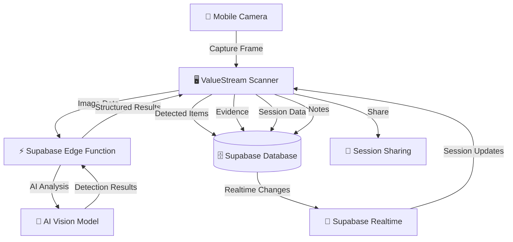
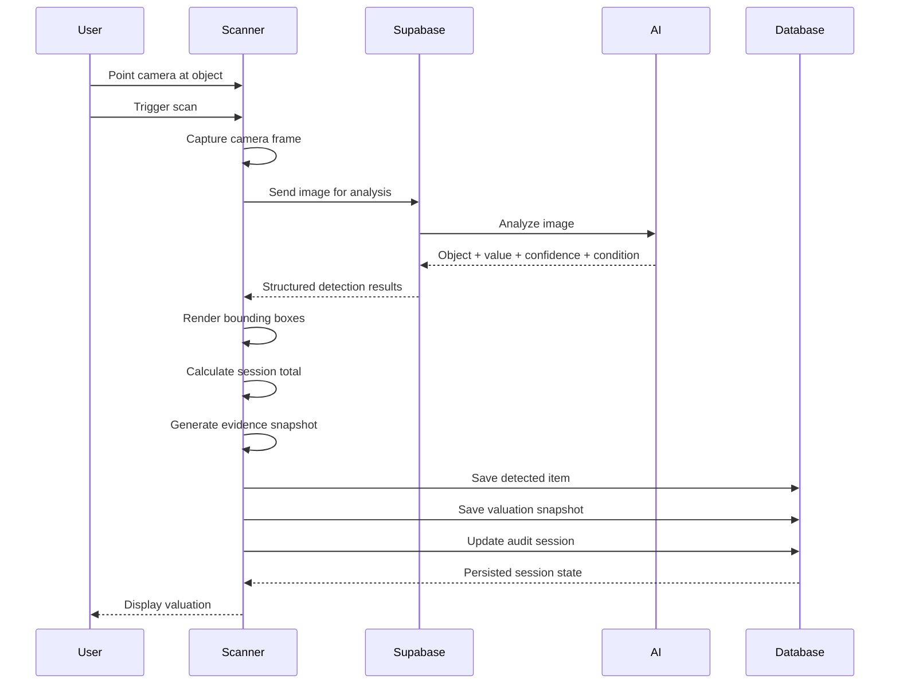
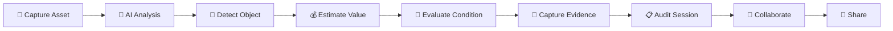

# ValueStream — AI-Powered Asset Valuation

> Turn your camera into an intelligent asset valuation tool. ValueStream uses AI-powered visual analysis to identify physical items, estimate their value, capture evidence, and organize everything into auditable sessions.

[](https://valuestream-eta.vercel.app/)
[](https://react.dev/)
[](https://www.typescriptlang.org/)
[](https://vitejs.dev/)
[](https://supabase.com/)
[](https://tailwindcss.com/)
[](https://web.dev/progressive-web-apps/)

---

## Overview

ValueStream is a camera-first AI asset valuation platform designed to make physical asset appraisal faster, more accessible, and easier to document.

Instead of manually identifying an object, researching its market value, evaluating its condition, and documenting the result separately, ValueStream combines the workflow into one interactive scanning experience.

Users can point their camera at physical assets and receive structured valuation information directly inside the scanner interface.

The platform brings together:

- AI-powered visual analysis
- Object detection
- Estimated asset values
- Confidence scoring
- Condition and damage analysis
- Interactive bounding boxes
- Evidence snapshots
- Running valuation totals
- Audit sessions
- Session notes
- Voice narration
- Real-time session updates
- Session sharing
- Progressive Web App capabilities

The goal is simple:

> **Turn a camera into an intelligent asset-auditing interface.**

---

## Live Application

### Production

**[https://valuestream-eta.vercel.app/](https://valuestream-eta.vercel.app/)**

### Repository

**[https://github.com/Novadgaf-stack/valuestream](https://github.com/Novadgaf-stack/valuestream)**

---

# The Problem

Physical asset valuation is often fragmented.

A user may need to:

```text
Identify an Item
      ↓
Research the Product
      ↓
Compare Market Prices
      ↓
Evaluate Condition
      ↓
Estimate Value
      ↓
Capture Evidence
      ↓
Document the Result
      ↓
Share the Appraisal
```

This process can be slow, inconsistent, and difficult to maintain when multiple assets need to be inspected.

For businesses, inspectors, merchants, lenders, resellers, and other users working with physical assets, the lack of a structured valuation workflow can make asset documentation unnecessarily difficult.

---

# The Solution

ValueStream compresses that workflow into a camera-first experience.

```text
        📱 Camera
           ↓
     🧠 AI Analysis
           ↓
    Object Detection
           ↓
    Value Estimation
           ↓
 Condition / Confidence
           ↓
   Evidence Capture
           ↓
    Audit Session
           ↓
 ┌─────────────────────┐
 │ Dashboard           │
 │ Collaboration       │
 │ Notes               │
 │ Sharing             │
 └─────────────────────┘
```

The result is an interactive appraisal workspace rather than a simple camera application.

---

# Core Features

## 1. Camera-Based AI Scanning

The scanner uses the device camera to capture frames for analysis.

Users can point their camera toward physical objects and trigger AI-powered valuation analysis without manually entering product information.

The scanner supports:

- Rear-facing camera selection
- High-resolution capture
- JPEG frame capture
- Responsive camera rendering
- Camera permission handling
- Scan state indicators
- Loading states
- Error states
- Mobile and desktop layouts

---

## 2. Object Detection

When objects are detected, ValueStream creates structured detection records containing information such as:

- Object name
- Estimated value
- Confidence score
- Bounding box coordinates
- Width and height
- Condition status
- Damage information

Detected objects are rendered directly over the camera interface.

This allows users to understand what the system identified without leaving the scanner.

---

## 3. Interactive Bounding Boxes

Detected objects appear as interactive bounding boxes over the camera feed.

Each detection can be selected to expose additional information and interact with the scanner's voice narration system.

This creates a visual appraisal experience instead of presenting the results as a traditional table.

---

## 4. AI Asset Valuation

Every detected item receives an estimated value.

ValueStream aggregates detected values into a running session total.

Example:

```text
Detected Item A          $450
Detected Item B          $220
Detected Item C          $780
                         ─────
Total Value            $1,450
```

The total valuation is displayed directly through the scanner interface and stored as part of the audit session.

---

## 5. Condition & Damage Detection

Valuation does not exist independently from physical condition.

Detected objects can include condition information such as:

- Damage status
- Visible wear
- Condition classification
- Depreciation-related information

Condition data is stored alongside the valuation to provide additional context when reviewing an appraisal.

---

## 6. Evidence Capture

ValueStream can create visual evidence for detected objects.

When an object is detected, the application can extract the relevant region from the captured frame and preserve it as an evidence snapshot.

Evidence can contain:

- Object name
- Estimated value
- Confidence score
- Snapshot
- Detection timestamp
- Confidence history

This provides a visual record that can be reviewed alongside the valuation.

---

## 7. Confidence Tracking

AI results are presented with confidence information rather than being treated as absolute truth.

ValueStream can track confidence associated with detected objects and maintain confidence history across scans.

This gives users additional context when evaluating the reliability of an AI-generated result.

---

## 8. Audit Sessions

Every scanning workflow is organized into an audit session.

A session can contain:

- Session title
- Total valuation
- Item count
- Detected items
- Evidence
- Notes
- Session timestamps
- Active/inactive state

Sessions can be ended and saved for later review.

---

## 9. Session Notes

Users can attach notes to an audit session to preserve human context alongside AI-generated information.

Examples include:

- Appraisal observations
- Inspection comments
- Item-specific notes
- Follow-up information
- Additional context

---

## 10. Voice Narration

ValueStream includes an accessibility-focused voice narration system.

Users can enable or disable voice output and select their preferred voice.

Detected objects can also be narrated individually.

Example:

```text
"Camera, $450"
```

This provides an alternative way to consume valuation information while interacting with the scanner.

---

## 11. Real-Time Collaboration

Audit sessions support real-time updates through Supabase Realtime.

Connected participants can receive session updates without requiring a manual refresh.

This creates the foundation for collaborative inspection and appraisal workflows.

---

## 12. Session Sharing

Audit sessions can be shared through the application's sharing functionality.

Shared session information can include:

- Session title
- Total value
- Item count
- Session information

This makes it easier to communicate valuation results without manually recreating the appraisal.

---

## 13. Progressive Web App

ValueStream is built as a Progressive Web App.

PWA functionality includes:

- Web app manifest
- Service worker
- Asset precaching
- Installable application support
- Responsive mobile experience
- Production caching

The goal is to provide a native-app-like experience directly from the browser.

---

# Technical Architecture

ValueStream follows a client-driven architecture where the React application communicates with Supabase services for persistence, server-side processing, authentication, and real-time functionality.



### Architecture Flow

```text
📱 Mobile Camera
       │
       │ Image Frame
       ▼
🖥️ ValueStream Scanner
       │
       │ Analysis Request
       ▼
⚡ Supabase Edge Function
       │
       │ AI Processing
       ▼
🧠 AI Vision Model
       │
       │ Structured Results
       ▼
🖥️ Scanner HUD
       │
       ├───────────────┐
       ▼               ▼
🗄️ Supabase DB    🔄 Realtime
       │               │
       └───────┬───────┘
               ▼
        📊 Audit Session
               │
        ┌──────┴──────┐
        ▼             ▼
   🔗 Sharing      👥 Collaboration
```

---

# Scanner Data Flow

The core scanning workflow follows this process:



---

# Database Architecture

ValueStream uses Supabase as its backend platform.

The application's data model is organized around audit sessions and the assets detected within them.

```text
User
 │
 └── Audit Session
       │
       ├── Detected Items
       │
       ├── Value Snapshots
       │
       ├── Evidence
       │
       ├── Session Notes
       │
       └── Collaborators
```

## Audit Sessions

Stores the overall appraisal session.

Typical session information includes:

- User
- Title
- Total value
- Item count
- Active state
- Start time
- End time

## Detected Items

Stores individual AI detection results.

Typical information includes:

- Object name
- Value
- Confidence
- Bounding box coordinates
- Damage status
- Session ID

## Value Snapshots

Stores valuation states throughout the session.

This allows the application to maintain historical valuation information as new objects are detected or existing results change.

## Evidence

Stores visual evidence associated with detected objects.

Evidence provides a visual reference for the valuation result and helps make an appraisal easier to review.

## Session Notes

Stores human-generated context associated with an audit session.

## Collaborators

Stores information required to support collaborative session experiences and real-time updates.

---

# Frontend Architecture

The frontend is built with React and TypeScript using a component-based architecture.

Scanner functionality is separated into reusable UI components and hooks.

Example structure:

```text
src/
├── components/
│   ├── BoundingBox.tsx
│   ├── CollaboratorPanel.tsx
│   ├── EvidencePanel.tsx
│   ├── SessionNotes.tsx
│   ├── ShareButton.tsx
│   ├── TotalValueTicker.tsx
│   ├── TruthLog.tsx
│   ├── VoiceSettings.tsx
│   └── WebcamView.tsx
│
├── hooks/
│   ├── useAuth.ts
│   ├── useRealtimeSession.ts
│   └── useVoiceNarration.ts
│
├── integrations/
│   └── supabase/
│       └── client.ts
│
├── pages/
│   ├── Dashboard.tsx
│   └── ...
│
├── lib/
│   └── ...
│
├── App.tsx
├── index.css
└── main.tsx
```

---

# Scanner Interface

The scanner is designed around a camera-first HUD interface.

Conceptually:

```text
┌─────────────────────────────────────────────┐
│ ←                  READY       🔊 ⚙         │
│                                             │
│                                             │
│               CAMERA FEED                   │
│                                             │
│       ┌─────────────────────┐               │
│       │       LAPTOP        │               │
│       │                     │               │
│       │        $850         │               │
│       └─────────────────────┘               │
│                                             │
│                 $1,450                      │
│                                             │
│                    ◉                        │
│                                             │
│       Items   Notes   Share   Users         │
│                                             │
│               End Session                   │
└─────────────────────────────────────────────┘
```

The interface is optimized for:

- Mobile devices
- Desktop browsers
- Touch interaction
- Camera-based workflows
- High-visibility scanning states
- Responsive layouts

---

# Design System

ValueStream uses a premium dark-first visual system built around a **Deep Navy + Burgundy** palette.

## Primary Colors

| Token | Value |
|---|---|
| Deep Navy | `#060B18` |
| Navy Surface | `#101827` |
| Slate Navy | `#182233` |
| Burgundy | `#7A1F3D` |
| Rich Burgundy | `#B02A55` |
| Soft Slate | `#2A364B` |
| Primary Text | `#F8FAFC` |
| Secondary Text | `#94A3B8` |
| Muted Text | `#64748B` |

## Interface Principles

The UI combines:

- Dark-first visual hierarchy
- Glassmorphism
- HUD-inspired interfaces
- Subtle grid effects
- Burgundy interaction states
- Smooth transitions
- Camera overlays
- Motion-based feedback
- Accessible contrast
- Responsive layouts
- Mobile-first interaction patterns

---

# Tech Stack

## Frontend

- React
- TypeScript
- Vite
- Tailwind CSS
- shadcn/ui
- Lucide React
- Framer Motion
- React Router
- React Webcam

## Backend

- Supabase
- Supabase Edge Functions
- Supabase Database
- Supabase Realtime
- Supabase Authentication

## AI

- AI-powered image analysis
- Structured object detection
- Value estimation
- Confidence scoring
- Condition analysis
- Damage detection

## PWA

- Vite PWA
- Service Worker
- Web App Manifest
- Workbox
- Asset precaching

## Development

- Node.js
- npm
- Git
- GitHub

## Deployment

- Vercel
- Supabase

---

# Project Structure

```text
valuestream/
│
├── public/
│   ├── icons/
│   └── ...
│
├── src/
│   ├── components/
│   ├── hooks/
│   ├── integrations/
│   ├── lib/
│   ├── pages/
│   ├── App.tsx
│   ├── index.css
│   └── main.tsx
│
├── supabase/
│   ├── functions/
│   ├── migrations/
│   └── ...
│
├── package.json
├── package-lock.json
├── tailwind.config.ts
├── vite.config.ts
├── tsconfig.json
└── README.md
```

---

# Getting Started

## Prerequisites

Make sure the following are installed:

- Node.js
- npm
- Git

You will also need a Supabase project configured for the application's backend functionality.

---

## Installation

Clone the repository:

```bash
git clone https://github.com/Novadgaf-stack/valuestream.git
```

Move into the project:

```bash
cd valuestream
```

Install dependencies:

```bash
npm install
```

---

# Environment Variables

Create a `.env` file in the project root.

Add the required Supabase configuration:

```env
VITE_SUPABASE_URL=your_supabase_project_url
VITE_SUPABASE_PUBLISHABLE_KEY=your_supabase_publishable_key
```

Additional secrets required by Supabase Edge Functions should be configured through the Supabase project rather than committed to the repository.

Never commit real API keys, service-role keys, or private credentials to GitHub.

---

# Development

Start the development server:

```bash
npm run dev
```

The application will be available through the local Vite development server.

---

# Type Checking

Run TypeScript validation:

```bash
npx tsc --noEmit
```

---

# Production Build

Create a production build:

```bash
npm run build
```

The generated production files are placed inside:

```text
dist/
```

---

# Preview Production Build

To preview the production build locally:

```bash
npm run preview
```

---

# Deployment

ValueStream is deployed using Vercel.

### Production Application

**[https://valuestream-eta.vercel.app/](https://valuestream-eta.vercel.app/)**

### Deployment Process

```text
GitHub Repository
       ↓
     Vercel
       ↓
Environment Variables
       ↓
Production Build
       ↓
Live Application
```

For a new deployment:

1. Push the repository to GitHub.
2. Import the repository into Vercel.
3. Configure the required environment variables.
4. Deploy the project.
5. Verify the production build.
6. Test camera permissions.
7. Verify Supabase connectivity.
8. Test the scanner workflow.

---

# Security Considerations

ValueStream handles camera-derived information and application session data.

Important security practices include:

- Never commit API keys.
- Keep server-side AI credentials inside Supabase Edge Function secrets.
- Use Supabase authentication for protected application data.
- Apply appropriate Row Level Security policies.
- Validate data received by Edge Functions.
- Avoid storing unnecessary camera data.
- Use HTTPS in production.
- Restrict sensitive database operations to authorized users.
- Keep publishable frontend credentials separate from server-side secrets.

Camera access requires a secure browser context, so production deployments should use HTTPS.

---

# Performance Considerations

ValueStream is designed around a camera-first interaction model.

Performance considerations include:

- Optimized production builds
- Efficient React rendering
- Controlled camera frame capture
- Image compression for captured evidence
- Service-worker caching
- Responsive UI rendering
- Controlled analysis requests
- Lazy loading where appropriate
- Error recovery for failed analysis requests
- Protection against overlapping scanner operations

The scanner prevents unnecessary overlapping analysis requests while another scan is being processed.

---

# Error & Rate-Limit Handling

ValueStream includes client-side protection around AI analysis requests.

When an analysis request fails or the service responds with a rate-limit or gateway-related error, the scanner can temporarily enter a cooldown state before another scan can be attempted.

The application communicates these states through:

- Loading indicators
- Toast notifications
- Scanner status indicators
- Cooldown messages
- Error log entries

This helps prevent repeated requests from unnecessarily overwhelming the analysis service.

---

# Accessibility

Accessibility is considered throughout the interface.

ValueStream includes:

- Keyboard-accessible controls
- Clear visual states
- Screen-friendly typography
- Voice narration
- High-contrast interface elements
- Responsive layouts
- Accessible interactive controls
- Alternative audio feedback for detected objects

Voice narration provides an additional way to consume scanner information without relying entirely on visual feedback.

---

# What Makes ValueStream Different?

Traditional valuation workflows separate identification, research, valuation, evidence collection, documentation, and sharing.

ValueStream brings these workflows together.

## Traditional Workflow

```text
Identify
   ↓
Search
   ↓
Research
   ↓
Estimate
   ↓
Document
   ↓
Share
```

## ValueStream

```text
          📷
       Scan Item
          ↓
      🧠 AI Analysis
          ↓
 ┌────────────────────┐
 │ Object             │
 │ Value              │
 │ Confidence         │
 │ Condition          │
 │ Evidence           │
 └────────────────────┘
          ↓
     Audit Session
          ↓
 ┌────────────────────┐
 │ Notes              │
 │ Collaboration      │
 │ Sharing            │
 └────────────────────┘
```

The fundamental idea is:

> **The camera becomes the entry point to the entire valuation workflow.**

---

# Product Workflow



---

# Future Improvements

Potential future development areas include:

- More advanced valuation models
- Improved market-data grounding
- Historical price comparison
- Multi-currency valuation
- Exportable appraisal reports
- PDF report generation
- Advanced analytics
- Portfolio-level asset tracking
- Improved offline synchronization
- More granular collaboration permissions
- Additional AI analysis providers
- Automated appraisal summaries
- Historical valuation trends
- Enhanced evidence management
- Advanced asset search

---

# Current Status

ValueStream is **deployed and functional**.

The current application includes the core:

- Camera scanning
- AI analysis
- Object detection
- Valuation
- Confidence scoring
- Condition analysis
- Evidence capture
- Audit sessions
- Session notes
- Voice narration
- Sharing
- Collaboration
- PWA functionality

### Production

**[https://valuestream-eta.vercel.app/](https://valuestream-eta.vercel.app/)**

### Repository

**[https://github.com/Novadgaf-stack/valuestream](https://github.com/Novadgaf-stack/valuestream)**

---

# Author

Built by **Isaac Akinkunmi**

Full-Stack Developer

GitHub: **[Novadgaf-stack](https://github.com/Novadgaf-stack)**

---

# License

This project is currently maintained as a portfolio and product development project.

All rights reserved unless otherwise specified.
